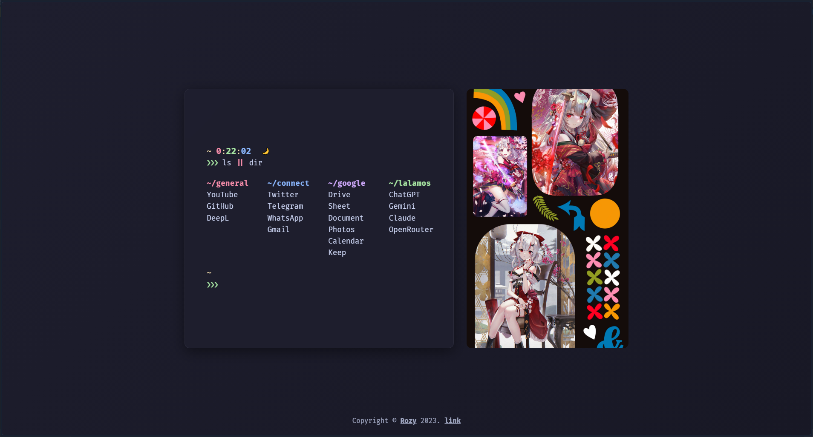
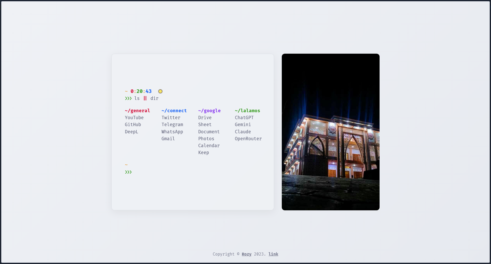

# Startpage

Custom browser startpage — also works as a Chrome extension.

## Showcase

| Dark mode (Mocha)                     | Light mode (Latte)                      |
| ------------------------------------- | --------------------------------------- |
|  |  |

## Features

- **Catppuccin theme** — Mocha (dark) default, Latte (light) toggle
- **Theme toggle** — 🌙/☀️ button, persisted in localStorage
- **Terminal aesthetic** — Fira Code font, `❯❯❯` prompt, clock
- **4 link groups**: `~/general`, `~/connect`, `~/google`, `~/lalamos`
- **Google search** box with autofocus
- **Favicon** — Nakiri Ayame chibi sticker
- **Glassmorphism** panel, gradient backgrounds
- **Seeded variation** — every seed produces unique output

## Usage

Open `index.html` in any browser, or install as a Chrome extension:

1. Go to `chrome://extensions`
2. Enable "Developer mode"
3. Click "Load unpacked" → select this folder

## Credits

Forked from [robzyy/startpage](https://robzyy.github.io/startpage/).
